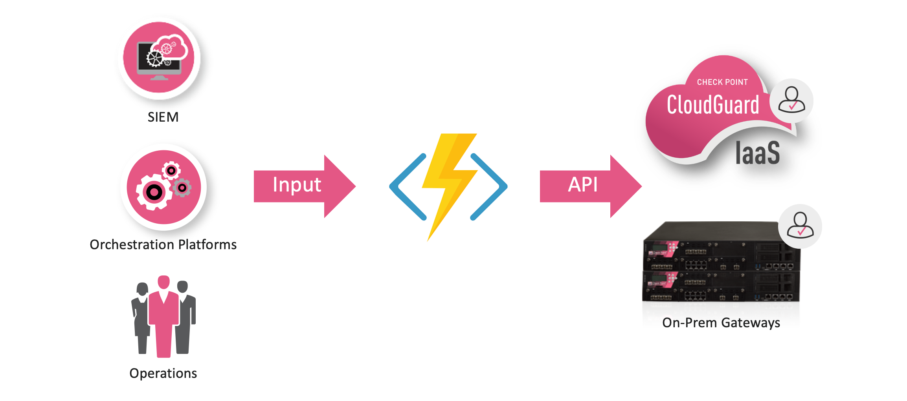

# Azure Function to Check Point Security Gateway Identity Awareness API
This Azure function will allow you to add/delete IP addresses on Check Point security gateway without a policy push. This allows operations team to make changes without having to go through intenal change management process. 

This is commonly used to block a suspicious IP address or grant temporary access to/from an IP address.

## How the function works?

The function consumes an HTTP post containing target IP, role, and session-timeout to be added/deleted into the Check Point Gateway Identity Awareness enabled Gateway. 

<p align="left">
 </a>
</p>

## Prerequisite
Before you get started, make sure you have the following requirements in place:
- An Azure account with an active subscription. [Create an account for free](https://azure.microsoft.com/free/?ref=microsoft.com&utm_source=microsoft.com&utm_medium=docs&utm_campaign=visualstudio).
- Install [Python](https://www.python.org/downloads/). 
- Install [Visual Studio code](https://code.visualstudio.com). A free source-code editor made by Microsoft for Windows, Linux and macOS. Features include support for debugging, syntax highlighting, intelligent code completion, snippets, code refactoring, and embedded Git.
- The [Azure Functions extension](https://marketplace.visualstudio.com/items?itemName=ms-azuretools.vscode-azurefunctions) for Visual Studio Code.
- Check Point Security Gateway deployed

## Setting up your Azure Function

### 1. Clone the repository

```
git clone https://github.com/CheckPointSW-Community/AzureFunction-to-IDA-API
```

### 2. Modify the function/gateways.txt file with gateway IP address and secret

```
10.0.0.1:somesecret
192.168.0.1:somesecret
```

### 3. Deploy the function

1. Navigate to the **Azure extension** in Visual Studio code on the left navigation bar. You should see a 'Local Project' folder representing your local Azure Function.

2. Press **F5** (or use the **Debug > Start Debugging** menu command) to launch the debugger and attach to the Azure Functions host. (This command automatically uses the single debug configuration that Azure Functions created.)
    
3. The Azure Function extension will automatically generate a few files for local development, install dependencies, and install the Function Core tools if not already present. These tools help with the debugging experience.
    
4. Output from the Functions Core tools appears in the VS Code **Terminal** panel. Once the host has started, **Alt+click** the local URL shown in the output to open the browser and run the function. You can also see the url of the Local Function by right clicking on the function on the Azure Functions explorer.
    
5. Follow steps of [this](https://docs.microsoft.com/en-us/azure/developer/python/tutorial-vs-code-serverless-python-05) guide to deploy your Azure Function to your subscription and get a live API endpoint URL. Write down the Azure Function API Endpoint URL, we will use this URL to post our requests to. 

6. Follow steps of [this](https://docs.microsoft.com/en-us/azure/azure-functions/ip-addresses) guide to get Function app outbound IP addresses. Write down the Azure Function outbound IP addresses, we will need to add these IP addresses to Check Point Security Gateway in step 2 below. 
    
## Check Point Gateway Configuration

1. Create Identity Awareness role object. We will use this object in our security policy. 

    - From SmartConsole -> New object -> More -> User -> Access Role -> YourRoleName -> Press "Ok" to create
    
2. Create a new Network Group and populate group with each Azure Function app IP addresses from Step 6. 

     - From SmartConsole -> New Network Group -> YourAzureFunctionGroupName -> Add each IP address to group

3. Enable Check Point Security Gateway Identity Awareness per [this](https://sc1.checkpoint.com/documents/latest/IdentityAPIs/#ida_api_config~v1%20) guide.

    - Under the Authorized Clients and Selected Client Secret section, use the AzureFunction Group name from step 2.

    - Use the gateway secret from step 2 of Setting up your Azure Function.

4. Create the desired security policy for the role. This example will block all IP address in/out of configured firewall. You can also define rules specific to your application. 
    
    ```
    - Example 1 
        Source: BadIPRole
        Destination: Any
        Service: Any
        Action: Drop    

    - Example 2
        Source: WebServersRole
        Destination: AppServersRole
        Service: http/http
        Action: Accept
    ```

5. Push security policy to all gateways for the changes to take effect and start testing. 

## How to use

HTTP Post to the function with the following body

- Add IP address to gateway.
```
curl -k -v --request POST -H 'Content-Type: application/json' -d '{ "action":"add", "ip":"1.1.1.1", "role":"BlockGroupRole", "session-timeout":300 }' https://your-function-api-endpoint.azurewebsites.net/api/HttpTrigger1
```
- Delete IP address fromn gateway.
```
curl -k -v --request POST -H 'Content-Type: application/json' -d '{ "action":"delete", "ip":"1.1.1.1" }' https://your-function-api-endpoint.azurewebsites.net/api/HttpTrigger1
```

## Considerations 
### Securing your Azure Functions 
Common ways to secure an Azure Function is: 
1. Secure it with an access key
2. Limit access using NSG or Firewalls
3. Set function as an internal endpoint

For more information please refer to [this](https://docs.microsoft.com/en-us/azure/azure-functions/security-concepts) article.

## Troubleshooting
1. Leverage Visual Studio Code debug function to make sure the application works locally before deploying in Azure. You will need to add your PC IP address as an Authorized Client. 

2. 404 error: This usually means the gateway secret is incorrect or your PC IP address if testing locally or Azure function IP is not an Authorized Client. Refer to step 3 - Check Point Gateway Configuration. 

3. Make sure Azure Function ranges can reach the gateway. For the list of IP address of your function, please refer to step 6 - Deploy the function. 